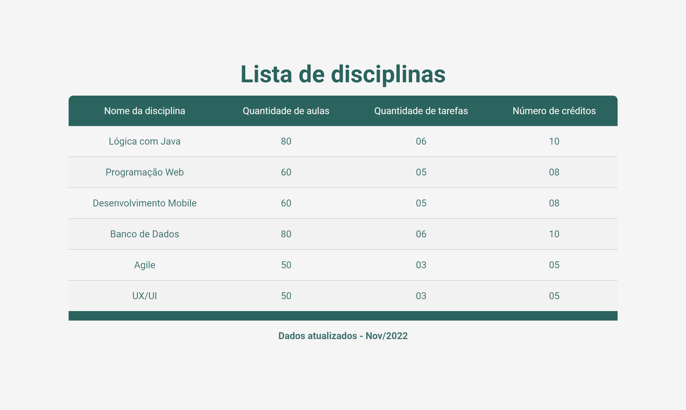

<h1 align="center"> 📄 Lista de Disciplinas </h1>

  <a href="#-tecnologias">Tecnologias</a>&nbsp;&nbsp;&nbsp;|&nbsp;&nbsp;&nbsp;
  <a href="#-projeto">Projeto</a>&nbsp;&nbsp;&nbsp;|&nbsp;&nbsp;&nbsp;

 

  

## 🚀 Tecnologias

Esse projeto foi desenvolvido com as seguintes tecnologias:

- HTML e CSS
- JavaScript
- [Node e NPM](https://nodejs.org/)
- [Vite](https://vitejs.dev/)

## 💻 Projeto

Um projeto para listagem de disciplinas. Desenvolvido durante o meu curso de ADS na FIAP.
